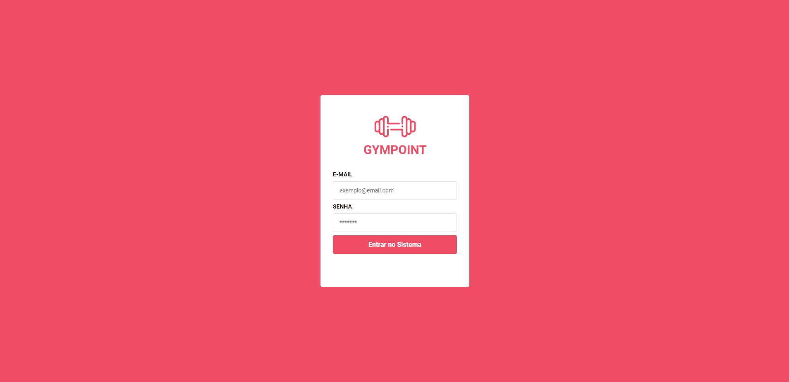
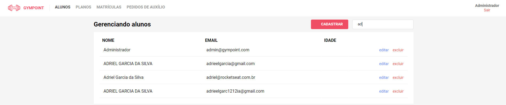
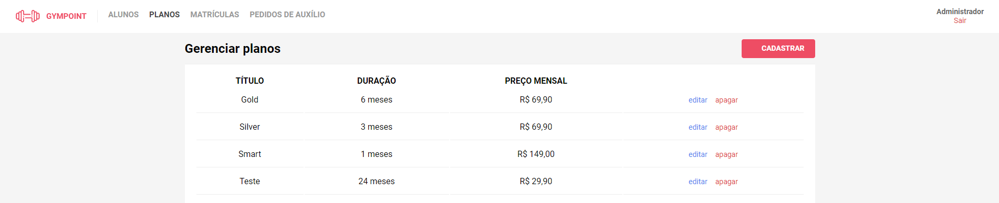
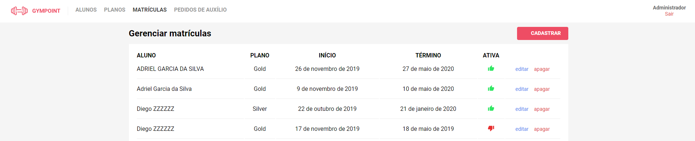
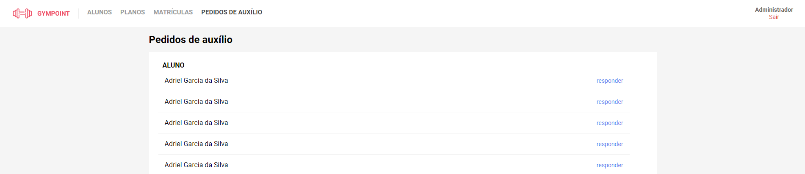

# Gympoint
Projeto desenvolvido como desafio final para o Bootcamp GoStack da Rocketseat.

<h2>App Mobile Android</h2>


<h2>Aplicação Web</h2>







<h2>Instruções para instalação do projeto</h2>

<h2>Back-end:</h2>

<h4>Docker:</h4>

[Link para download](https://www.docker.com/)

<h4>Postgres:</h4>

`docker run --name NOME_DO_CONTAINER -e POSTGRES_PASSWORD=docker -p 5432:5432 -d postgres:11`

<h4>Redis (fila de envio de e-mails):</h4>

`docker run --name NOME_DO_CONTAINER -p 6379:6379 -d -t redis:alpine`

<h4>backend/.env:</h4>

`Inserir configurações do Postgres, Redis, serviço de e-mail e senha para geração do token de autenticação`

<h4>Após criar DB executar para criação das tabelas (na raiz do projeto):</h4>

`yarn sequelize db:migrate`

<h4>Para criar o usuário admin:</h4>

`yarn sequelize db:seed:all`

<h4>src/server.js:</h4>

`app.listen(PORTA)`

<h4>Executar na raiz do projeto para instalação das dependências:</h4>

`yarn`

<h4>Executar back-end:</h4>

`yarn dev`


<h2>Front-end:</h2>

<h4>Endereço para requests da API do backend:</h4>
<h4>src/services/api.js:</h4>

`baseURL: 'http://ENDERECO-BACK-END:PORTA'`

<h4>Executar na raiz do projeto para instalação das dependências:</h4>

`yarn`

<h4>Executar front-end:</h4>

`yarn start`


<h2>Mobile</h2>

<h4>App desenvolvido no SO Android</h4>


<h4>Instalar React Native CLI e emulador android</h4>

[Tutorial aqui](https://facebook.github.io/react-native/docs/getting-started)

<h4>src/services/api.js:</h4>

```
baseURL: 'http://ENDERECO-BACK-END:PORTA'

Obs: Caso o endereço seja localhost e o emulador usado seja do Android Studio, localhost é 10.0.2.2
````

<h4>Executar na raiz do projeto:</h4>

`react-native run-android`
